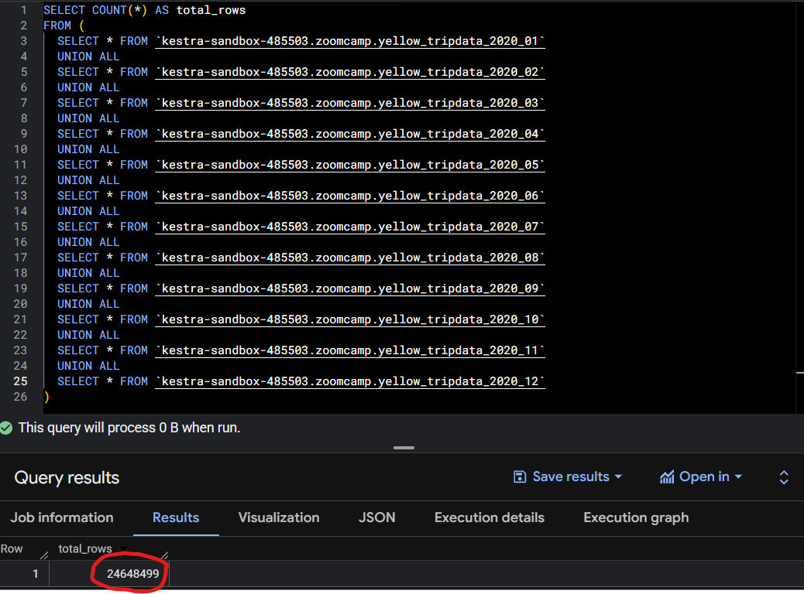
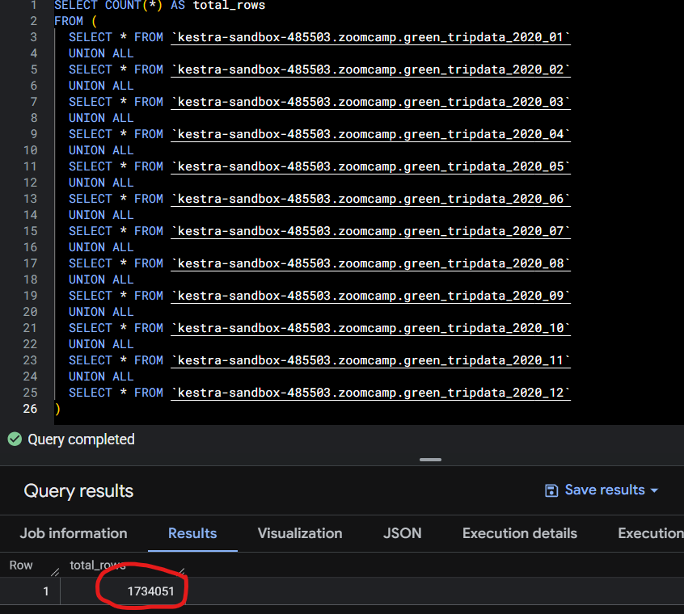
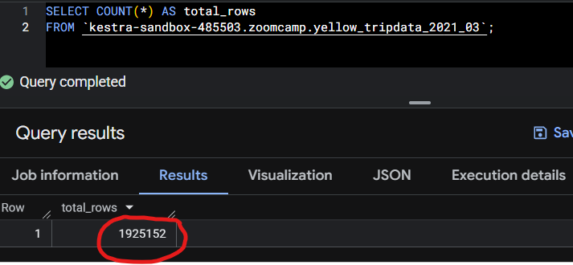

# Module 1 Homework: Workflow Orchestration

This repository contains my solution for **Module 1 - Workflow Orchestration**.

---

## Question 1

Within the execution for `Yellow` Taxi data for the year `2020` and month `12`: what is the uncompressed file size (i.e. the output file `yellow_tripdata_2020-12.csv` of the `extract` task)?

**Answer**: `134.5 MiB`

---

## Question 2

What is the rendered value of the variable file when the inputs taxi is set to green, year is set to 2020, and month is set to 04 during execution?

**Answer:** `green_tripdata_2020-04.csv`

## Question 3:

How many rows are there for the `Yellow` Taxi data for all CSV files in the year 2020?

**Answer**: `24,648,499`

## Question 4

How many rows are there for the `Green` Taxi data for all CSV files in the year 2020?

**Answer**: `1,734,051`

## Question 5. Biggest pickup zone

Which was the pickup zone with the largest total_amount (sum of all trips) on November 18th, 2025?

**Answer**: `East Harlem North`

## Question 6. Largest tip

For the passengers picked up in the zone named "East Harlem North" in November 2025, which was the drop off zone that had the largest tip?

Note: it's `tip` , not `trip`. We need the name of the zone, not the ID.

**Answer**: `Yorkville West`

## Terraform Exercise

[`main.tf`](https://github.com/mjoshua97241/data-engineering-zoomcamp/blob/main/homework/01-docker-terraform/terraform/main.tf)
[`variable.tf`](https://github.com/mjoshua97241/data-engineering-zoomcamp/blob/main/homework/01-docker-terraform/terraform/variable.tf)

## Question 7. Terraform Workflow

Which of the following sequences, respectively, describes the workflow for:

    1. Downloading the provider plugins and setting up backend,
    2. Generating proposed changes and auto-executing the plan
    3. Remove all resources managed by terraform`

**Answer**: `terraform init, terraform apply -auto-approve, terraform destroy`
